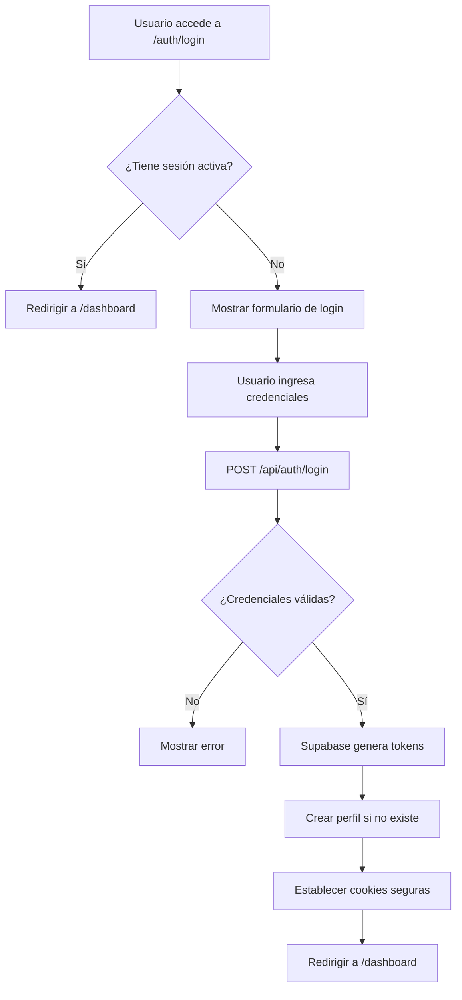
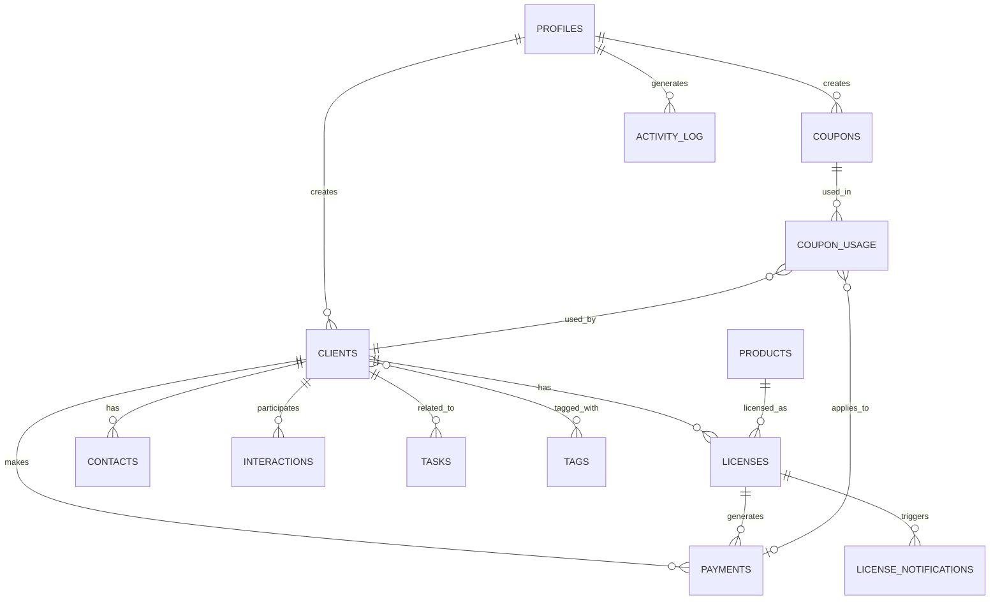
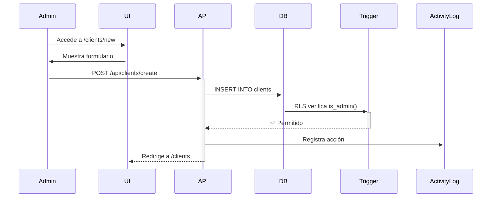
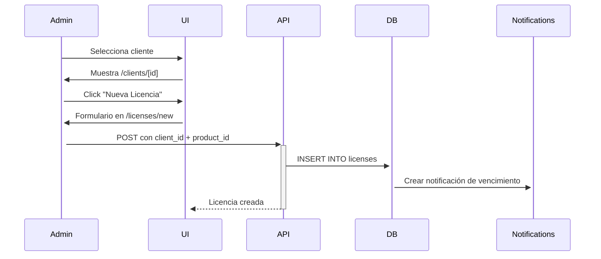
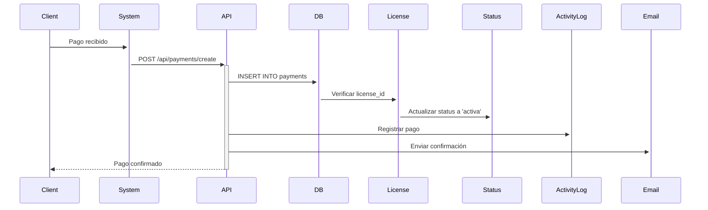

# 📚 Documentación SoftControl CRM

## Índice
1. [Sistema de Autenticación](#sistema-de-autenticación)
2. [Modelo de Datos](#modelo-de-datos)
3. [Roles y Permisos](#roles-y-permisos)
4. [Flujo de Trabajo](#flujo-de-trabajo)

---

## 🔐 Sistema de Autenticación

### Cómo Funciona el Login

El sistema de autenticación está construido sobre **Supabase Auth** con gestión de sesiones mediante cookies seguras.

#### Flujo de Autenticación



#### 1. **Formulario de Login** (`/auth/login.astro`)

```astro
// El usuario ingresa email y password
<form method="POST" action="/api/auth/login">
  <input type="email" name="email" required />
  <input type="password" name="password" required />
  <button type="submit">Iniciar Sesión</button>
</form>
```

#### 2. **Procesamiento de Credenciales** (`/api/auth/login.ts`)

```typescript
// 1. Recibir credenciales del formulario
const email = formData.get('email');
const password = formData.get('password');

// 2. Autenticar con Supabase
const { data, error } = await supabase.auth.signInWithPassword({
  email,
  password,
});

// 3. Si es exitoso, obtener tokens
const accessToken = data.session.access_token;
const refreshToken = data.session.refresh_token;
```

#### 3. **Creación/Verificación de Perfil**

Cuando un usuario inicia sesión por primera vez, se ejecuta un **trigger en PostgreSQL** que crea automáticamente su perfil:

```sql
-- Trigger que se ejecuta automáticamente al crear usuario
CREATE TRIGGER on_auth_user_created
  AFTER INSERT ON auth.users
  FOR EACH ROW EXECUTE FUNCTION handle_new_user();

-- Función que crea el perfil
CREATE FUNCTION handle_new_user()
RETURNS TRIGGER AS $$
BEGIN
  INSERT INTO public.profiles (id, full_name, role)
  VALUES (
    NEW.id,
    COALESCE(NEW.raw_user_meta_data->>'full_name', 'Usuario'),
    COALESCE(NEW.raw_user_meta_data->>'role', 'staff')  -- Por defecto: staff
  );
  RETURN NEW;
END;
$$;
```

#### 4. **Establecimiento de Cookies**

```typescript
// Cookies HTTPOnly y Secure para mayor seguridad
cookies.set('sb-access-token', accessToken, {
  path: '/',
  httpOnly: true,
  secure: true,
  sameSite: 'lax',
  maxAge: 60 * 60 * 24 * 7, // 7 días
});

cookies.set('sb-refresh-token', refreshToken, {
  path: '/',
  httpOnly: true,
  secure: true,
  sameSite: 'lax',
  maxAge: 60 * 60 * 24 * 30, // 30 días
});
```

#### 5. **Middleware de Protección** (`middleware.ts`)

Todas las rutas protegidas pasan por el middleware:

```typescript
export async function onRequest(context, next) {
  const accessToken = context.cookies.get('sb-access-token')?.value;
  
  // Rutas públicas (login, signup)
  if (publicRoutes.includes(pathname)) {
    return next();
  }
  
  // Verificar si hay token
  if (!accessToken) {
    return context.redirect('/auth/login');
  }
  
  // Verificar validez del token
  const { data: { user }, error } = await supabase.auth.getUser(accessToken);
  
  if (error || !user) {
    return context.redirect('/auth/login');
  }
  
  // Permitir acceso
  return next();
}
```

#### 6. **Cerrar Sesión** (`/api/auth/logout.ts`)

```typescript
// 1. Invalidar sesión en Supabase
await supabase.auth.signOut();

// 2. Eliminar cookies
cookies.delete('sb-access-token', { path: '/' });
cookies.delete('sb-refresh-token', { path: '/' });

// 3. Redirigir a login
return redirect('/auth/login');
```

### Seguridad Implementada

✅ **HTTPOnly Cookies**: Las cookies no son accesibles desde JavaScript  
✅ **Secure Flag**: Solo se transmiten por HTTPS  
✅ **SameSite**: Protección contra CSRF  
✅ **Token Refresh**: Renovación automática de tokens  
✅ **Row Level Security (RLS)**: Cada usuario solo ve sus datos autorizados  

---

## 📊 Modelo de Datos

### Diagrama de Relaciones



### Tablas Principales

#### 1. **profiles** - Perfiles de Usuario
Almacena información adicional de usuarios autenticados con sus roles.

| Campo | Tipo | Descripción |
|-------|------|-------------|
| `id` | UUID | PK, referencia a `auth.users` |
| `full_name` | TEXT | Nombre completo del usuario |
| `role` | TEXT | Rol: `'admin'` o `'staff'` |
| `created_at` | TIMESTAMP | Fecha de creación |

**Relaciones:**
- Referencia `auth.users(id)` (tabla de Supabase Auth)
- Crea clientes (`clients.created_by`)
- Crea cupones (`coupons.created_by`)

---

#### 2. **clients** - Clientes
Información de los clientes de la empresa.

| Campo | Tipo | Descripción |
|-------|------|-------------|
| `id` | UUID | PK, generado automáticamente |
| `name` | TEXT | Nombre del cliente |
| `email` | TEXT | Email del cliente |
| `phone` | TEXT | Teléfono |
| `company` | TEXT | Empresa del cliente |
| `created_at` | TIMESTAMP | Fecha de creación |
| `created_by` | UUID | FK a `profiles`, quién lo creó |

**Relaciones:**
- Tiene licencias → `licenses.client_id`
- Tiene pagos → `payments.client_id`
- Tiene contactos → `contacts.client_id`
- Tiene interacciones → `interactions.client_id`
- Tiene tareas → `tasks.client_id`
- Tiene etiquetas → `client_tags.client_id`

---

#### 3. **products** - Productos
Catálogo de productos/servicios ofrecidos.

| Campo | Tipo | Descripción |
|-------|------|-------------|
| `id` | UUID | PK |
| `name` | TEXT | Nombre del producto |
| `description` | TEXT | Descripción detallada |
| `price_one_payment` | NUMERIC | Precio de compra única |
| `price_subscription` | NUMERIC | Precio de suscripción mensual |
| `created_at` | TIMESTAMP | Fecha de creación |

**Ejemplo:**
```sql
{
  "name": "CRM Profesional",
  "price_one_payment": 999.00,  -- Pago único
  "price_subscription": 79.00    -- Mensual
}
```

---

#### 4. **licenses** - Licencias
Licencias asignadas a clientes.

| Campo | Tipo | Descripción |
|-------|------|-------------|
| `id` | UUID | PK |
| `client_id` | UUID | FK a `clients` |
| `product_id` | UUID | FK a `products` |
| `type` | TEXT | `'licencia_unica'` o `'suscripcion'` |
| `start_date` | DATE | Fecha de inicio |
| `end_date` | DATE | Fecha de vencimiento (NULL si es perpetua) |
| `status` | TEXT | `'activa'`, `'inactiva'`, `'pendiente_pago'` |
| `created_at` | TIMESTAMP | Fecha de creación |

**Tipos de Licencia:**
- **licencia_unica**: Pago único, puede ser perpetua (`end_date = NULL`)
- **suscripcion**: Renovación periódica, requiere `end_date`

---

#### 5. **payments** - Pagos
Historial de pagos realizados.

| Campo | Tipo | Descripción |
|-------|------|-------------|
| `id` | UUID | PK |
| `client_id` | UUID | FK a `clients` |
| `license_id` | UUID | FK a `licenses` (opcional) |
| `amount` | NUMERIC | Monto del pago |
| `currency` | TEXT | Moneda (por defecto 'EUR') |
| `payment_method` | TEXT | Método: 'card', 'transfer', 'paypal', etc. |
| `paid_at` | TIMESTAMP | Cuándo se realizó el pago |
| `created_at` | TIMESTAMP | Cuándo se registró |

---

#### 6. **coupons** - Cupones de Descuento
Sistema de cupones y promociones.

| Campo | Tipo | Descripción |
|-------|------|-------------|
| `id` | UUID | PK |
| `code` | TEXT | Código único del cupón |
| `description` | TEXT | Descripción |
| `discount_type` | TEXT | `'percentage'` o `'fixed_amount'` |
| `discount_value` | NUMERIC | Valor del descuento |
| `max_uses` | INTEGER | Usos máximos totales |
| `current_uses` | INTEGER | Usos actuales |
| `max_uses_per_client` | INTEGER | Usos por cliente |
| `min_purchase_amount` | NUMERIC | Compra mínima requerida |
| `valid_from` | TIMESTAMP | Válido desde |
| `valid_until` | TIMESTAMP | Válido hasta |
| `is_active` | BOOLEAN | Si está activo |
| `applicable_products` | UUID[] | Array de IDs de productos aplicables |
| `created_by` | UUID | FK a `profiles` |

**Ejemplo:**
```sql
{
  "code": "NAVIDAD2025",
  "discount_type": "percentage",
  "discount_value": 20,        -- 20% de descuento
  "max_uses": 100,
  "max_uses_per_client": 1,
  "min_purchase_amount": 50.00,
  "valid_until": "2025-12-31"
}
```

---

#### 7. **coupon_usage** - Uso de Cupones
Registro de cuándo se usa cada cupón.

| Campo | Tipo | Descripción |
|-------|------|-------------|
| `id` | UUID | PK |
| `coupon_id` | UUID | FK a `coupons` |
| `client_id` | UUID | FK a `clients` |
| `payment_id` | UUID | FK a `payments` (opcional) |
| `discount_applied` | NUMERIC | Descuento aplicado |
| `created_at` | TIMESTAMP | Cuándo se usó |

---

#### 8. **license_notifications** - Notificaciones de Licencias
Sistema de alertas automáticas para licencias próximas a vencer.

| Campo | Tipo | Descripción |
|-------|------|-------------|
| `id` | UUID | PK |
| `license_id` | UUID | FK a `licenses` |
| `client_id` | UUID | FK a `clients` |
| `notification_type` | TEXT | `'expiration_warning'`, `'expired'`, `'renewed'` |
| `days_before_expiration` | INTEGER | Días antes de vencer |
| `sent` | BOOLEAN | Si se envió |
| `sent_at` | TIMESTAMP | Cuándo se envió |
| `email_sent_to` | TEXT | Email destino |
| `error_message` | TEXT | Error si falló |
| `created_at` | TIMESTAMP | Cuándo se creó |

---

#### 9. **activity_log** - Registro de Actividades
Auditoría completa del sistema.

| Campo | Tipo | Descripción |
|-------|------|-------------|
| `id` | UUID | PK |
| `user_id` | UUID | FK a `profiles` |
| `action` | TEXT | Acción realizada |
| `entity_type` | TEXT | Tipo de entidad (client, license, etc.) |
| `entity_id` | UUID | ID de la entidad afectada |
| `description` | TEXT | Descripción detallada |
| `metadata` | JSONB | Datos adicionales en JSON |
| `ip_address` | INET | Dirección IP del usuario |
| `created_at` | TIMESTAMP | Cuándo ocurrió |

**Ejemplo:**
```sql
{
  "action": "UPDATE",
  "entity_type": "client",
  "entity_id": "uuid-del-cliente",
  "description": "Actualizado nombre de cliente",
  "metadata": {
    "old_name": "Juan Pérez",
    "new_name": "Juan Pérez García"
  }
}
```

---

#### 10. **system_settings** - Configuración del Sistema
Configuración global de la aplicación.

| Campo | Tipo | Descripción |
|-------|------|-------------|
| `id` | UUID | PK |
| `key` | TEXT | Clave única de configuración |
| `value` | JSONB | Valor en formato JSON |
| `description` | TEXT | Descripción del setting |
| `updated_at` | TIMESTAMP | Última actualización |
| `updated_by` | UUID | FK a `profiles` |

---

### Tablas Auxiliares

#### **contacts** - Personas de Contacto
Personas específicas dentro de empresas cliente.

| Campo | Tipo | Descripción |
|-------|------|-------------|
| `client_id` | UUID | FK a `clients` |
| `first_name` | TEXT | Nombre |
| `last_name` | TEXT | Apellido |
| `email` | TEXT | Email |
| `phone` | TEXT | Teléfono |
| `position` | TEXT | Cargo |
| `is_primary` | BOOLEAN | Contacto principal |

---

#### **interactions** - Interacciones con Clientes
Historial de comunicaciones.

| Campo | Tipo | Descripción |
|-------|------|-------------|
| `client_id` | UUID | FK a `clients` |
| `contact_id` | UUID | FK a `contacts` |
| `interaction_type` | TEXT | `'call'`, `'email'`, `'meeting'`, `'note'` |
| `subject` | TEXT | Asunto |
| `description` | TEXT | Descripción detallada |
| `interaction_date` | TIMESTAMP | Cuándo ocurrió |

---

#### **tasks** - Tareas
Tareas relacionadas con clientes.

| Campo | Tipo | Descripción |
|-------|------|-------------|
| `client_id` | UUID | FK a `clients` |
| `title` | TEXT | Título de la tarea |
| `description` | TEXT | Descripción |
| `status` | TEXT | `'pending'`, `'in_progress'`, `'completed'`, `'cancelled'` |
| `priority` | TEXT | `'low'`, `'medium'`, `'high'`, `'urgent'` |
| `due_date` | TIMESTAMP | Fecha límite |

---

#### **tags** - Etiquetas
Etiquetas para categorizar clientes.

| Campo | Tipo | Descripción |
|-------|------|-------------|
| `name` | TEXT | Nombre de la etiqueta |
| `color` | TEXT | Color en hexadecimal (#RRGGBB) |

---

#### **client_tags** - Relación Cliente-Etiquetas
Tabla intermedia many-to-many.

| Campo | Tipo | Descripción |
|-------|------|-------------|
| `client_id` | UUID | FK a `clients` |
| `tag_id` | UUID | FK a `tags` |

---

## 🔒 Roles y Permisos

### Row Level Security (RLS)

Cada tabla tiene políticas RLS que garantizan que:

#### **ADMIN** (role = 'admin')
- ✅ **SELECT**: Ver todos los registros
- ✅ **INSERT**: Crear nuevos registros
- ✅ **UPDATE**: Modificar registros existentes
- ✅ **DELETE**: Eliminar registros

#### **STAFF** (role = 'staff')
- ✅ **SELECT**: Ver todos los registros
- ❌ **INSERT**: No puede crear
- ❌ **UPDATE**: No puede modificar
- ❌ **DELETE**: No puede eliminar

### Ejemplo de Política RLS

```sql
-- Política para que todos vean clientes
CREATE POLICY "Authenticated users can view clients"
  ON clients FOR SELECT
  TO authenticated
  USING (true);

-- Solo admins pueden crear clientes
CREATE POLICY "Only admins can insert clients"
  ON clients FOR INSERT
  TO authenticated
  WITH CHECK (is_admin());

-- Función auxiliar
CREATE FUNCTION is_admin()
RETURNS BOOLEAN AS $$
BEGIN
  RETURN EXISTS (
    SELECT 1 FROM profiles
    WHERE id = auth.uid() AND role = 'admin'
  );
END;
$$;
```

---

## 🔄 Flujo de Trabajo

### 1. Registro de Nuevo Cliente



### 2. Asignación de Licencia



### 3. Procesamiento de Pago



---

## 📈 Vistas y Consultas Útiles

### Vista: Resumen de Clientes

```sql
CREATE VIEW client_summary AS
SELECT 
  c.id,
  c.name,
  c.email,
  c.company,
  COUNT(DISTINCT l.id) as total_licenses,
  COUNT(DISTINCT CASE WHEN l.status = 'activa' THEN l.id END) as active_licenses,
  MAX(p.paid_at) as last_payment_date,
  SUM(p.amount) as total_paid
FROM clients c
LEFT JOIN licenses l ON c.id = l.client_id
LEFT JOIN payments p ON c.id = p.client_id
GROUP BY c.id, c.name, c.email, c.company;
```

### Vista: Licencias Próximas a Vencer

```sql
CREATE VIEW expiring_licenses AS
SELECT 
  l.id,
  c.name as client_name,
  c.email as client_email,
  p.name as product_name,
  l.end_date,
  l.status,
  EXTRACT(DAY FROM l.end_date - CURRENT_DATE) as days_until_expiry
FROM licenses l
JOIN clients c ON l.client_id = c.id
JOIN products p ON l.product_id = p.id
WHERE l.type = 'suscripcion' 
  AND l.status = 'activa'
  AND l.end_date IS NOT NULL
  AND l.end_date <= CURRENT_DATE + INTERVAL '30 days'
ORDER BY l.end_date;
```

---

## 🛠️ Mantenimiento

### Backup de Base de Datos

```bash
# Desde Supabase Dashboard
# Project Settings > Database > Backups
# O usando pg_dump:
pg_dump -h db.xxxxx.supabase.co -U postgres -d postgres > backup.sql
```

### Actualizar Rol de Usuario

```sql
-- Promover usuario a admin
UPDATE profiles 
SET role = 'admin' 
WHERE id = 'uuid-del-usuario';

-- Degradar a staff
UPDATE profiles 
SET role = 'staff' 
WHERE id = 'uuid-del-usuario';
```

---

## 📞 Soporte

Para más información o problemas técnicos, consulta:
- Documentación de Supabase: https://supabase.com/docs
- Documentación de Astro: https://docs.astro.build
- Repositorio del proyecto: (tu repositorio)

---

**Última actualización**: 14 de diciembre de 2025
